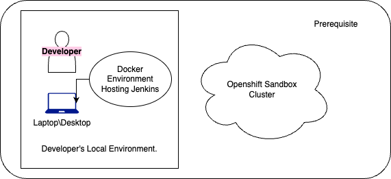

# webserver-test

This repository contains a basic HTML page that can be built in a Docker environment and run inside a Docker or Openshift container.

## Pre-requisite

1)Local docker environment.  
2)Up and running Jenkins instance.  
3)Up and running Openshift cluster.  

### Folder Structure

Repository is structured as mentioned below:
1) source folder - Contains the required HTML pages and supporting files.  
2) cicd - Contains:  
        a) The buildpipeline to run docker build and to upload the docker image to git repository.  
        b) The deploypipeline to deploy the respective version of docker image into openshift.  
3) configuration - contains the deployment yaml for openshift deployment.  
4)Dockerfile - contains required steps to build docker image.  

### Branching details
The repo consist of 3 branches:
 a)Main: the default branch.  
 b)dockerhub: containing scripts based on build and deploy into docker.  
 c)openshift: containing scripts based on build and deploy into openshift cluster.  
 
## Deployment/Project execution steps
1)Clone the required branch(dockerhub\openshift) of this repo to a local workspace.  
2)To build the image you can chose any of below options:  
    * You can directly run docker build using the Dockerfile in the root folder of this repo.  
    * Create a job in jenkins and configure the respective branch of this repo and buildpipeline present under the cicd folder.  
       - Run this pipeline in a docker based workspace. The image will be built and also uploaded into dockerhub.  
       - Currently the values are hardcoded, based on your need the value of githubURL\dockerhubRepo can be changed.  
3)To deploy the image you can choose any of below options:  
    * You can use docker run command and launch the image in local docker environment.  
    * Create a job in jenkins and configure the respective branch and the deploypipeline from cicd folder.  
       - Run this pipeline and image will be pushed to your openshift cluster.  
       - Currently the values are hardcoded, based on your need the value of openshift cluster and image url can be changed.  
4)Once deployment is completed you will be able to access the webpage by accessing URL in below format:  
 ```shell
http://<localhost\clusterurl>:<port>\hellodevops.html
```

+-------------------------+      +-------------------------+       +-----------------------------+
|   Start (Git Repository)|      |   Dockerfile Created    |       |    Docker Image Built     |
|                         |      |                         |       |                           |
|                         |      |                         |       |                           |
+------------+------------+      +-------------+-----------+       +--------------+------------+
             |                                 |                                 |
             v                                 v                                 v
+-------------------------+      +-------------------------+       +-----------------------------+
|   Git Clone Repository  |      |   Create Dockerfile    |       |   Build Docker Image       |
|                         |      |                         |       |                           |
|                         |      |                         |       |                           |
+------------+------------+      +-------------+-----------+       +--------------+------------+
             |                                 |                                 |
             v                                 v                                 v
+-------------------------+      +-------------------------+       +-----------------------------+
|   HTML Page Created     |      |   Docker Build Command |       |   Docker Image Available   |
|                         |      |                         |       |                           |
|                         |      |                         |       |                           |
+------------+------------+      +-------------+-----------+       +--------------+------------+
             |                                 |                                 |
             v                                 v                                 v
+-------------------------+      +-------------------------+       +-----------------------------+
|   Commit Changes        |      |   Docker Image Pushed   |       |   Docker Image Pulled     |
|                         |      |   to Docker Registry    |       |   on Target Machine       |
|                         |      |                         |       |                           |
+------------+------------+      +-------------+-----------+       +--------------+------------+
             |                                 |                                 |
             v                                 v                                 v
+-------------------------+      +-------------------------+       +-----------------------------+
|  Push Changes to Git    |      |   Deploy Docker Image   |       |   Access HelloWorld Page  |
| Repository              |      |   on Target Machine     |       |                           |
|                         |      |                         |       |                           |
+-------------------------+      +-------------------------+       +-----------------------------+
             |                                                         |
             v                                                         v
+-------------------------+                                       +-----------------------------+
|    End (Successful)     |                                       |      End (Hello World)      |
|                         |                                       |                             |
+-------------------------+                                       +-----------------------------+
